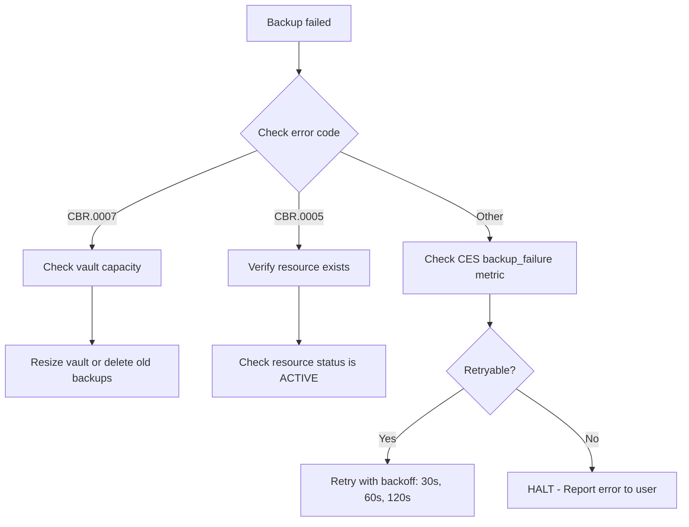
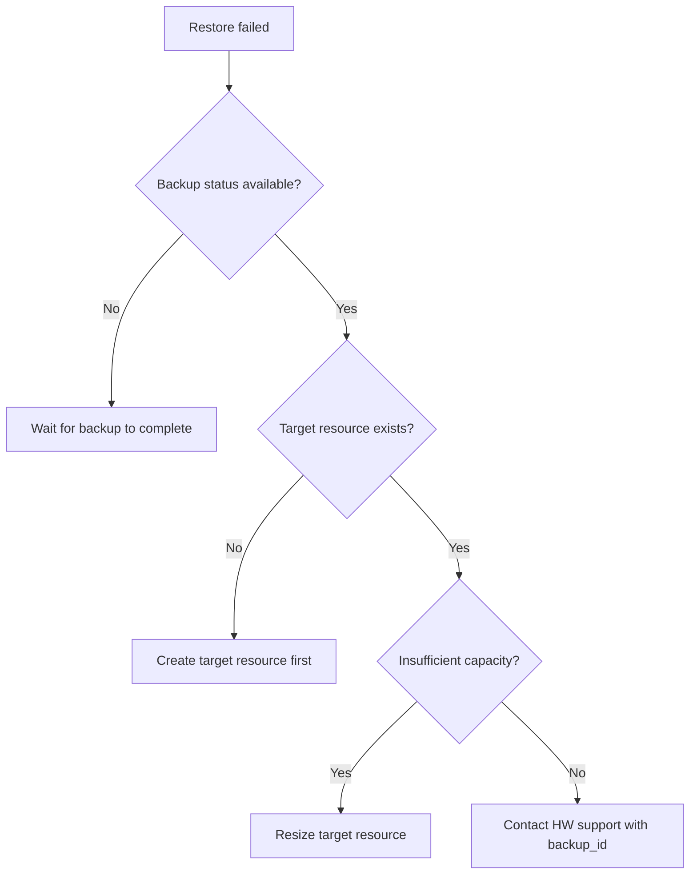

> This skill follows the [Agent Skill Open Specification](https://agentskills.io/specification).

# Huawei Cloud CBR (Cloud Backup and Recovery) Operations Skill

## Overview

Huawei Cloud CBR provides fully-managed backup and recovery services for ECS, RDS, DCS, and other cloud resources. This skill is an **operational runbook** for agents: explicit scope, credential rules, pre-flight checks, **dual-path execution** (official CLI and JIT Go SDK fallback), response validation, and failure recovery.

### CLI applicability (repository policy)

- **`cli_applicability: dual-path`:** Official CLI supports CBR. In each execution flow below, document **both** the SDK step **and** the CLI step.

## Five Core Standards (Quality Gates)

| # | Standard | How This Skill Fulfills It |
|---|----------|---------------------------|
| 1 | **Clear Boundaries** | SHOULD/SHOULD NOT Use conditions with precise triggers and delegation rules |
| 2 | **Structured I/O** | `{{env.*}}` / `{{user.*}}` / `{{output.*}}` placeholders with typed sources |
| 3 | **Explicit Actionable Steps** | Every operation: Pre-flight → Execute (CLI + SDK) → Validate → Recover |
| 4 | **Complete Failure Strategies** | 12 CBR error codes with HALT vs retry per error type |
| 5 | **Absolute Single Responsibility** | One product (CBR), one primary resource (vault); cross-product delegation documented |

### Three-Pillar Ops Integration (FinOps + SecOps + AIOps)

| Pillar | Skill Integration | Reference |
|--------|-------------------|-----------|
| **FinOps** | Backup storage cost analysis, billing model comparison, retention policy cost optimization | `references/well-architected-assessment.md` §3 |
| **SecOps** | IAM minimum permissions, KMS encryption, vault policy, backup data isolation | `references/well-architected-assessment.md` §4 |
| **AIOps** | ≥ 4 anomaly patterns (backup failure spike, vault capacity, slow restore), cross-skill diagnosis | `references/well-architected-assessment.md` §5 |

### Well-Architected Framework Integration (卓越架构)

| Pillar | Skill Integration |
|--------|-------------------|
| **安全 (Security)** | IAM permissions, credential masking, KMS encryption, vault-level access policies |
| **稳定 (Stability)** | Automated backup policies, cross-region replication, retention rules, DR runbook |
| **成本 (Cost)** | Billing model comparison (按需 vs 包年包月), retention period optimization, storage tiering |
| **效率 (Efficiency)** | Batch resource association, policy-based automation, CLI pipeline |
| **性能 (Performance)** | Backup window optimization, incremental backup, bandwidth-aware replication |

## Trigger & Scope (Agent-Readable)

### SHOULD Use This Skill When

- User mentions "Huawei Cloud CBR" OR "cloud backup" OR "云备份" OR "备份" OR "存储库" OR "恢复"
- Task involves CRUD or lifecycle operations on backup vaults (create, delete, modify, list)
- Task involves backup policy creation, modification, association with resources
- Task involves on-demand backup execution, restore, or cross-region replication
- Task keywords: **backup**, **restore**, **vault**, **recovery point**, **replication**, **CBR**, **云备份**, **RPO**, **RTO**

### SHOULD NOT Use This Skill When

- Task is purely billing/account management → delegate to: billing skill (when present)
- Task is IAM/permission model only → delegate to: `huaweicloud-iam-ops`
- Task is about instance-level backup that CBR uses (ECS/DCS/RDS) → delegate to respective skill for instance operations
- Task is about monitoring/alarm rules → delegate to: `huaweicloud-ces-ops`
- Task is about audit log analysis → delegate to: `huaweicloud-cts-ops`

## Variables

| Variable | Source | Description | Example |
|----------|--------|-------------|---------|
| `{{env.HW_ACCESS_KEY_ID}}` | Environment | Huawei Cloud AK | `AKIA...` |
| `{{env.HW_SECRET_ACCESS_KEY}}` | Environment | Huawei Cloud SK | `***` (masked) |
| `{{env.HW_REGION_ID}}` | Environment | Region code | `cn-north-4` |
| `{{env.HW_PROJECT_ID}}` | Environment | Project ID | `a1b2c3d4...` |
| `{{user.vault_id}}` | User | Backup vault UUID | `vault-abc123` |
| `{{user.vault_name}}` | User | Vault name | `prod-ecs-backup-vault` |
| `{{user.vault_type}}` | User | Vault type | `server` (ECS), `disk` (EVS), `turbo` (SFS) |
| `{{user.billing_mode}}` | User | Billing mode | `prePaid` or `postPaid` |
| `{{user.storage_size}}` | User | Vault capacity (GB) | `1000` |
| `{{user.policy_id}}` | User | Backup policy UUID | `policy-abc123` |
| `{{user.policy_name}}` | User | Policy name | `daily-backup-00-00` |
| `{{user.backup_id}}` | User | Backup/restore point ID | `backup-abc123` |
| `{{user.resource_id}}` | User | Resource to backup (ECS/RDS ID) | `ecs-abc123` |
| `{{user.resource_type}}` | User | Resource type | `OS::Nova::Server` or `OS::Cinder::Volume` |
| `{{user.retention_days}}` | User | Backup retention in days | `30` |
| `{{user.replication_region}}` | User | Target region for replication | `cn-south-1` |
| `{{output.vault_id}}` | Output | Created vault ID | From API response |
| `{{output.backup_id}}` | Output | Created backup ID | From API response |

## Operations

### 1. Vault Management

#### 1.1 Create Backup Vault

**Pre-flight:**
- [ ] Verify `{{env.HW_ACCESS_KEY_ID}}` and `{{env.HW_SECRET_ACCESS_KEY}}` are set
- [ ] Choose vault type matching the resource type to protect
- [ ] Estimate storage capacity needs

**Execute (CLI):**
```bash
hcloud CBR CreateVault \
  --name="{{user.vault_name}}" \
  --type="{{user.vault_type}}" \
  --billing_mode="{{user.billing_mode}}" \
  --storage_size="{{user.storage_size}}" \
  --region="{{env.HW_REGION_ID}}"
```

**Execute (SDK - JIT Go):**
```go
package main

import (
    "fmt"
    "github.com/huaweicloud/huaweicloud-sdk-go-v3/core/auth/basic"
    "github.com/huaweicloud/huaweicloud-sdk-go-v3/services/cbr/v3"
    "github.com/huaweicloud/huaweicloud-sdk-go-v3/services/cbr/v3/model"
)

func main() {
    auth := basic.NewCredentialsBuilder().
        WithAk("{{env.HW_ACCESS_KEY_ID}}").
        WithSk("{{env.HW_SECRET_ACCESS_KEY}}").
        WithProjectId("{{env.HW_PROJECT_ID}}").
        Build()
    client := cbr.NewCbrClient(
        cbr.CbrClientBuilder().WithRegion("{{env.HW_REGION_ID}}").WithCredential(auth).Build(),
    )
    req := &model.CreateVaultReq{
        Name: "{{user.vault_name}}",
        Billing: &model.Billing{
            ObjectType: "{{user.vault_type}}",
            ObjectSize: int64({{user.storage_size}}),
        },
    }
    resp, err := client.CreateVault(req)
    if err != nil {
        panic(err)
    }
    fmt.Println(resp.Vault.Id)
}
```

**Validate:**
- [ ] Verify vault appears in `ListVaults` response
- [ ] Confirm vault status is `available`

**Recovery:**
| Error | Action |
|-------|--------|
| `CBR.0001` (quota exceeded) | Request quota increase or delete unused vaults |
| `CBR.0002` (invalid type) | Verify vault type matches resource type |
| `CBR.0003` (billing error) | Verify billing account has sufficient balance |

#### 1.2 List Vaults

**Execute (CLI):**
```bash
hcloud CBR ListVaults \
  --region="{{env.HW_REGION_ID}}"
```

**Execute (SDK - JIT Go):**
```go
req := &model.ListVaultsReq{}
resp, err := client.ListVaults(req)
for _, vault := range resp.Vaults {
    fmt.Printf("%s (%s) - %s, used: %dGB/%dGB\n",
        *vault.Name, *vault.Id, *vault.Billing.Status,
        *vault.Billing.Used, *vault.Billing.Size)
}
```

#### 1.3 Describe Vault

**Execute (CLI):**
```bash
hcloud CBR ShowVault \
  --vault_id="{{user.vault_id}}" \
  --region="{{env.HW_REGION_ID}}"
```

#### 1.4 Delete Vault

> **⚠️ DESTRUCTIVE OPERATION — All backups in vault will be permanently deleted.**

**Pre-flight:**
- [ ] Confirm vault ID with user
- [ ] Verify no resources are still associated with the vault
- [ ] Confirm user has exported or verified no backups are needed

**Execute (CLI):**
```bash
hcloud CBR DeleteVault \
  --vault_id="{{user.vault_id}}" \
  --region="{{env.HW_REGION_ID}}"
```

**Validate:**
- [ ] Vault no longer appears in `ListVaults`

### 2. Backup Policy Management

#### 2.1 Create Backup Policy

**Pre-flight:**
- [ ] Define backup schedule (frequency, time window)
- [ ] Define retention rules (max backups, retention days)

**Execute (CLI):**
```bash
hcloud CBR CreatePolicy \
  --name="{{user.policy_name}}" \
  --type="backup" \
  --schedule="FREQ=DAILY;INTERVAL=1;BYHOUR=0;BYMINUTE=0" \
  --retention_days="{{user.retention_days}}" \
  --region="{{env.HW_REGION_ID}}"
```

**Validate:**
- [ ] Policy appears in `ListPolicies`
- [ ] Verify schedule and retention parameters match input

#### 2.2 Associate Policy with Vault

**Execute (CLI):**
```bash
hcloud CBR AssociateVaultPolicy \
  --vault_id="{{user.vault_id}}" \
  --policy_id="{{user.policy_id}}" \
  --region="{{env.HW_REGION_ID}}"
```

#### 2.3 List Policies

**Execute (CLI):**
```bash
hcloud CBR ListPolicies \
  --region="{{env.HW_REGION_ID}}"
```

### 3. Backup Execution & Restore

#### 3.1 Create On-Demand Backup

**Pre-flight:**
- [ ] Identify vault ID and resource ID to backup
- [ ] Verify resource is in active/running state

**Execute (CLI):**
```bash
hcloud CBR CreateBackup \
  --vault_id="{{user.vault_id}}" \
  --resource_id="{{user.resource_id}}" \
  --resource_type="{{user.resource_type}}" \
  --name="manual-backup-$(date +%Y%m%d)" \
  --region="{{env.HW_REGION_ID}}"
```

**Validate:**
- [ ] Backup appears in `ListBackups` within 60 seconds
- [ ] Backup status transitions to `available`

#### 3.2 List Backups

**Execute (CLI):**
```bash
hcloud CBR ListBackups \
  --vault_id="{{user.vault_id}}" \
  --region="{{env.HW_REGION_ID}}"
```

#### 3.3 Restore from Backup

> **⚠️ DESTRUCTIVE OPERATION — Existing resource state will be overwritten.**

**Pre-flight:**
- [ ] Confirm restore with user — this overwrites current resource data
- [ ] Identify backup ID from `ListBackups`
- [ ] Verify the target resource is not in production critical usage

**Execute (CLI):**
```bash
hcloud CBR RestoreBackup \
  --backup_id="{{user.backup_id}}" \
  --resource_id="{{user.resource_id}}" \
  --region="{{env.HW_REGION_ID}}"
```

**Validate:**
- [ ] Resource status transitions to `RESTORING` then back to `ACTIVE`
- [ ] Verify data integrity post-restore

### 4. Cross-Region Replication

**Pre-flight:**
- [ ] Ensure destination region has CBR service enabled
- [ ] Verify vault exists in destination region (or create one)

**Execute (CLI):**
```bash
hcloud CBR ReplicateBackup \
  --backup_id="{{user.backup_id}}" \
  --destination_region="{{user.replication_region}}" \
  --destination_vault_id="{{user.vault_id}}" \
  --region="{{env.HW_REGION_ID}}"
```

**Validate:**
- [ ] Replication task completes with status `success`
- [ ] Backup appears in destination region's `ListBackups`

### 5. Monitoring

**Execute (CLI):**
```bash
# Query CBR metrics via CES
hcloud CES ListMetrics \
  --namespace="SYS.CBR" \
  --region="{{env.HW_REGION_ID}}"

# Query vault storage usage
hcloud CES ShowMetricData \
  --namespace="SYS.CBR" \
  --metric_name="vault_used_percent" \
  --dim="vault_id={{user.vault_id}}" \
  --period="3600" \
  --from="{{user.start_time}}" \
  --to="{{user.end_time}}" \
  --region="{{env.HW_REGION_ID}}"
```

## Failure Recovery

### Error Code Taxonomy

| Code | Error | Category | Retry | Action |
|------|-------|----------|-------|--------|
| `CBR.0001` | Vault quota exceeded | Quota | No | Request quota increase or delete unused vaults |
| `CBR.0002` | Invalid vault type | Config | No | Verify vault type matches resource type |
| `CBR.0003` | Billing account error | Config | No | Check account balance and billing status |
| `CBR.0004` | Vault not found | NotFound | No | Verify vault ID is correct |
| `CBR.0005` | Resource not found | NotFound | No | Verify resource ID exists and is active |
| `CBR.0006` | Backup not found | NotFound | No | Verify backup ID is correct |
| `CBR.0007` | Insufficient vault capacity | Resource | No | Resize vault or delete old backups |
| `CBR.0008` | Backup in progress | State | Yes (3x, 60s backoff) | Wait for current backup to complete |
| `CBR.0009` | Policy schedule conflict | Config | No | Modify policy schedule to avoid overlap |
| `CBR.0010` | Resource already associated with vault | Conflict | No | Disassociate first or use different vault |
| `CBR.0011` | Destination region unavailable | Config | No | Verify CBR is available in target region |
| `CBR.0012` | Replication bandwidth exceeded | Resource | Yes (3x, 120s backoff) | Reduce replication concurrency |

### Diagnostic Flow (Backup Failure)



### Diagnostic Flow (Restore Failure)



## Well-Architected Assessment

This skill follows the Huawei Cloud Well-Architected Framework across five pillars plus FinOps, SecOps, and AIOps. See:

- **Full Assessment:** [`references/well-architected-assessment.md`](references/well-architected-assessment.md)
- **Core Concepts:** [`references/core-concepts.md`](references/core-concepts.md)
- **API & SDK Usage:** [`references/api-sdk-usage.md`](references/api-sdk-usage.md)
- **CLI Usage:** [`references/cli-usage.md`](references/cli-usage.md)
- **Troubleshooting:** [`references/troubleshooting.md`](references/troubleshooting.md)
- **Monitoring:** [`references/monitoring.md`](references/monitoring.md)
- **Integration:** [`references/integration.md`](references/integration.md)
- **Idempotency Checklist:** [`references/idempotency-checklist.md`](references/idempotency-checklist.md)

## Appendices

### A. References

- [Huawei Cloud CBR API Documentation](https://support.huaweicloud.com/api-cbr/)
- [Huawei Cloud Go SDK](https://github.com/huaweicloud/huaweicloud-sdk-go-v3)
- [Huawei Cloud CLI](https://support.huaweicloud.com/hcli/index.html)

### B. Changelog

| Version | Date | Changes |
|---------|------|---------|
| 1.0.0 | 2026-05-21 | Initial CBR ops skill with vault, policy, backup, restore, replication |
