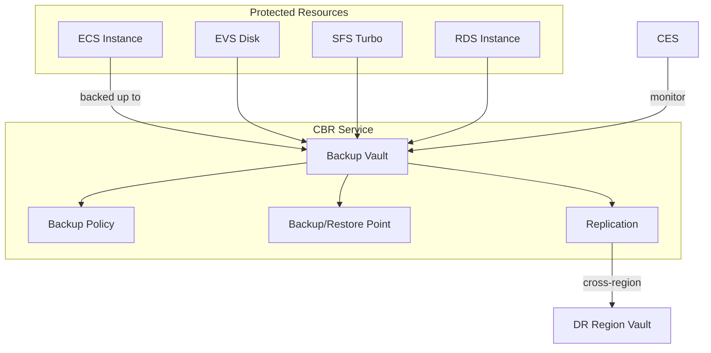

# Core Concepts — Huawei Cloud CBR (Cloud Backup and Recovery)

## Architecture Overview

Huawei Cloud CBR provides fully-managed backup and recovery services. It creates consistent point-in-time snapshots of cloud resources (ECS, EVS disks, SFS Turbo, etc.) and stores them in backup vaults with configurable retention policies.

### Core Components

### Vault Types

| Vault Type | `object_type` | Protects | Use Case |
|-----------|--------------|----------|----------|
| **Server** | `server` | ECS instances (OS + data disks) | Full server backup |
| **Disk** | `disk` | EVS block storage volumes | Individual disk backup |
| **Turbo** | `turbo` | SFS Turbo file systems | File storage backup |
| **Workspace** | `workspace` | Workspace desktops | Desktop backup |

### Resource Relationship Graph

- One **Vault** stores backups for 1+ resources of the same type
- One **Backup Policy** can be associated with 1+ vaults
- One **Resource** can be protected by 1+ backup policies (different schedules)
- **Cross-region Replication** copies backups from one region vault to another

## Regions & Availability Zones

- CBR vaults are **region-scoped**
- Backups are stored within the same region as the vault (by default)
- Cross-region replication copies backups to a vault in a different region
- Backup data does not span regions unless replication is configured

## Backup Types

| Type | Description | Speed | Storage Impact |
|------|-------------|-------|---------------|
| **Full** | Complete snapshot of all data | Slowest | Highest |
| **Incremental** | Only changed blocks since last backup | Fast | Minimal |
| **Differential** | Changed blocks since last full backup | Medium | Medium |

CBR uses **incremental forever** strategy — first backup is full, subsequent are incremental.

## Limits & Quotas

| Item | Default Quota | Max Request |
|------|--------------|-------------|
| Vaults per account | 50 | 200 (support ticket) |
| Backups per vault | 100 | 500 (support ticket) |
| Policies per account | 20 | 100 |
| Max retention days | 365 | Custom |
| Max vault capacity | 10 TB | 100 TB |
| Min backup interval | 1 hour | Configurable |

## Billing

| Component | Model | Cost Factor |
|-----------|-------|-------------|
| Vault capacity (storage) | 按需 or 包年包月 | Per GB per hour |
| Backup data transfer | Included in vault | N/A |
| Cross-region replication | Ingress/Egress | Per GB transferred |
| API calls | Free | N/A |
