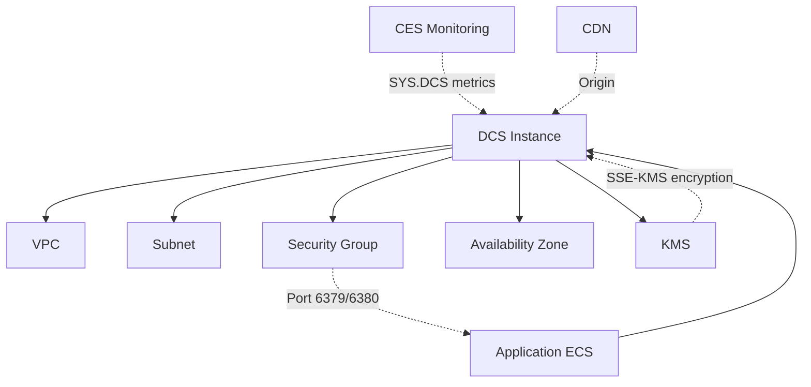
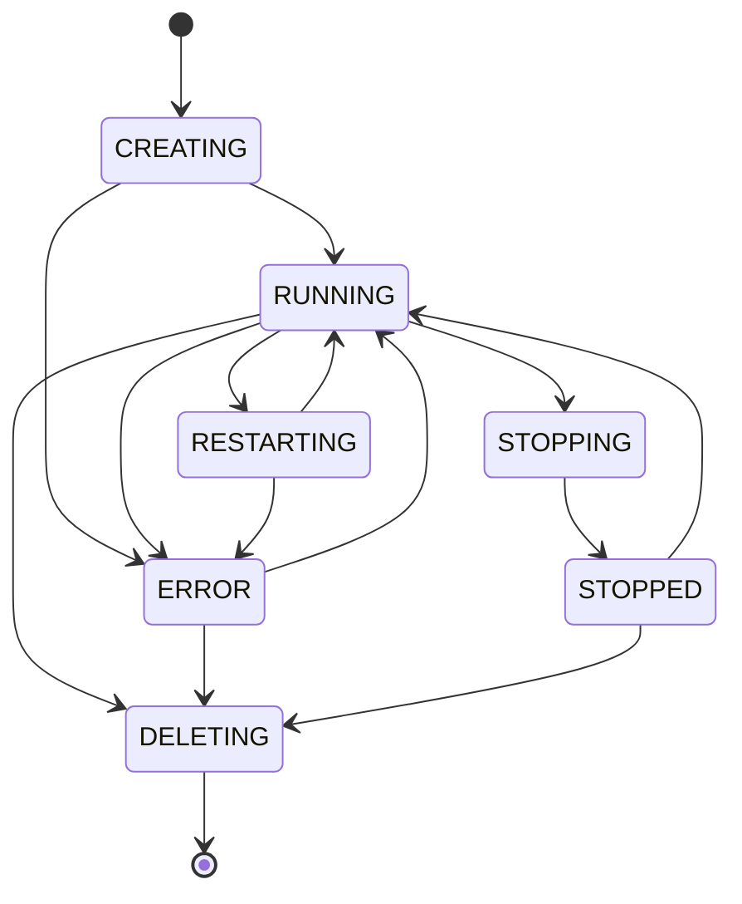

# Core Concepts — Huawei Cloud DCS (Distributed Cache Service)

## Architecture Overview

Huawei Cloud DCS provides fully-managed in-memory data store instances compatible with Redis and Memcached protocols. DCS manages the infrastructure, scaling, backup, and failover while users interact through standard Redis/Memcached client libraries.

### Instance Types

| Mode | Description | HA | Failover | Use Case |
|------|-------------|----|----------|---------|
| **Single** | Single-node, no replica | No | None | Dev/test, non-critical cache |
| **HA (Master-Standby)** | Active-primary with standby replica | Yes | Auto-failover (<30s) | Production, low RTO |
| **Cluster** | Sharded across multiple nodes (proxy or direct-connect) | Yes | Per-shard failover | High-throughput, large dataset (>16GB) |
| **Read/Write Split** | Master + read replicas (up to 8 read nodes) | Yes | Read replica auto-reconnect | Read-heavy workloads |

## Resource Relationship Graph

## Regions & Availability Zones

- DCS instances are **region-scoped** — a bucket/instance exists in exactly one region
- Multi-AZ is supported for HA mode: master in one AZ, standby in another AZ within same region
- Not all AZs support all instance types; check availability per region via API
- Cross-region replication requires manual export/import or third-party tools (not native)

## Instance Specifications & Limits

### Supported Engines

| Engine | Versions | Notes |
|--------|---------|-------|
| Redis | 4.0 | Legacy, limited features |
| Redis | 5.0 | Stream data type, modules |
| Redis | 6.0 | ACL, RESP3, thread I/O — **recommended** |
| Memcached | 1.x | Simple key-value, no persistence |

### Capacity Range by Instance Type

| Mode | Minimum | Maximum | Max Clients | Max Bandwidth |
|------|---------|---------|-------------|---------------|
| Single | 0.125 GB | 8 GB | 5,000 | 3 Gbps |
| HA | 0.125 GB | 32 GB | 40,000 | 6 Gbps |
| Cluster | 4 GB | 1024 GB | 200,000 | 48 Gbps |
| RW | 1 GB | 256 GB | 80,000 | 12 Gbps |

## Quotas & Limits

| Resource | Default Limit | How to Increase |
|----------|--------------|-----------------|
| DCS instances per account | 30 per region | Submit ticket |
| Max key name length | 512 bytes (Redis) | N/A |
| Max value size | 512 MB (Redis) | N/A |
| Max database number | 16 (Redis default 0) | N/A |
| Concurrent connections | Per spec (see above) | Upgrade spec |
| Pub/Sub channels | 4,000 | Upgrade spec |

## Network Requirements

- DCS instances must reside within a **VPC** and **subnet**
- **No public endpoint** — instances are only accessible through VPC
- Security group must allow inbound traffic on Redis port (default **6379**, 6380 for Redis 6.0 TLS)
- **IP whitelist** provides additional access control (layer between SG and Redis AUTH)
- For cross-VPC access: VPC peering connection or VPC Endpoint required
- Application ECS must be in the same VPC or have VPC peering with DCS VPC

## Data Persistence Modes

| Mode | Persistence | Backup Format | RPO Implication |
|------|------------|---------------|-----------------|
| **No persistence** | None (pure cache) | Manual backup creates RDB | Data lost on restart |
| **RDB snapshots** | Periodic full snapshots | `.rdb` files | RPO = snapshot interval |
| **AOF (Append Only File)** | Every write operation logged | `.aof` files + RDB | RPO ≈ 1 second (appendeverysec) |
| **Dual-sync** (HA) | RDB + AOF on master, replicated to standby | RDB | RPO ≈ failover replication lag (<1s) |

## Lifecycle States

| State | Description | Allowed Operations |
|-------|-------------|-------------------|
| CREATING | Instance provisioning in progress | ShowInstance only |
| RUNNING | Normal operation | All operations |
| ERROR | Operation failed | ShowInstance, Delete |
| RESTARTING | Reboot in progress | Wait |
| STOPPING | Stopping (only for pay-per-use) | Wait |
| STOPPED | Stopped (billing for storage continues) | Start, Delete |
| DELETING | Deletion in progress | Wait |

## Backup & Recovery

- **Automatic backup**: configurable schedule (daily/weekly), retention 1–7 days
- **Manual backup**: on-demand, RDB format, retains until manually deleted
- Backup data stored in OBS (Object Storage Service) — not billed separately
- **Restore options**:
  - New instance: create fresh instance from backup (non-destructive)
  - Overwrite: restore to existing instance (destroys current data)
- Restore operation is async — poll instance status

## SPOF Analysis

| Instance Type | SPOF Risk | Mitigation |
|--------------|-----------|------------|
| Single-node | **HIGH** — single node failure = data loss + downtime | Use HA mode for production |
| Master-Standby | **LOW** — standby takes over automatically (<30s RTO) | Enable AOF for minimal data loss |
| Cluster | **MEDIUM** — single shard failover is auto; multiple simultaneous shard fails = degraded | Monitor per-shard health, alert on dual-shard errors |
| Read/Write Split | **LOW** — read replica failure does not impact writes | Auto-reconnect failed read nodes |

## Cross-Product Delegation

| DCS Operation | Dependent Product | Delegate To |
|--------------|-------------------|-------------|
| Network setup (VPC, subnet, SG) | VPC | `huaweicloud-vpc-ops` |
| Monitoring & alarms | CES | `huaweicloud-ces-ops` |
| Encryption keys | KMS | `huaweicloud-kms-ops` (when present) |
| Billing analysis | BSS | Billing skill (when present) |
| Host security (ECS running Redis clients) | HSS | `huaweicloud-hss-ops` |
| Application logging | LTS | `huaweicloud-lts-ops` |
