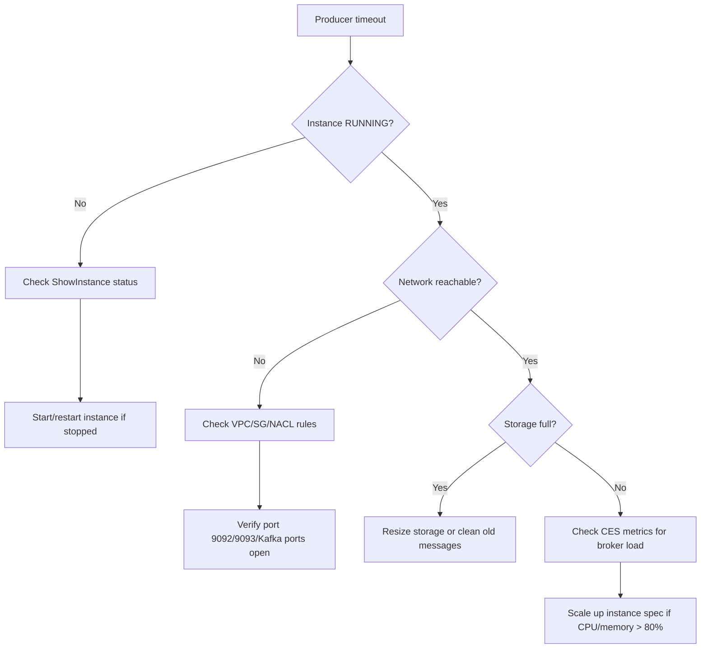
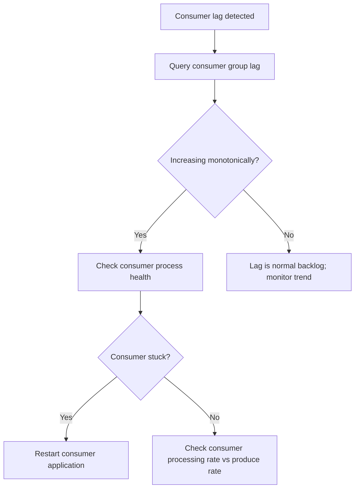

> This skill follows the [Agent Skill Open Specification](https://agentskills.io/specification).

# Huawei Cloud DMS (Distributed Message Service) Operations Skill

## Overview

Huawei Cloud DMS provides fully-managed Kafka and RabbitMQ message queue instances with automatic scaling, partition management, and high-availability. This skill covers both Kafka (partitioned topics, consumer groups) and RabbitMQ (queues, exchanges, bindings) instance types as an **operational runbook** for agents: explicit scope, credential rules, pre-flight checks, **dual-path execution** (official CLI and JIT Go SDK fallback), response validation, and failure recovery.

### CLI applicability (repository policy)

- **`cli_applicability: dual-path`:** Official CLI supports DMS. In each execution flow below, document **both** the SDK step **and** the CLI step.

## Five Core Standards (Quality Gates)

| # | Standard | How This Skill Fulfills It |
|---|----------|---------------------------|
| 1 | **Clear Boundaries** | SHOULD/SHOULD NOT Use conditions with precise triggers and delegation rules |
| 2 | **Structured I/O** | `{{env.*}}` / `{{user.*}}` / `{{output.*}}` placeholders with typed sources |
| 3 | **Explicit Actionable Steps** | Every operation: Pre-flight → Execute (CLI + SDK) → Validate → Recover |
| 4 | **Complete Failure Strategies** | 12 DMS error codes with HALT vs retry per error type |
| 5 | **Absolute Single Responsibility** | One product (DMS), two engines (Kafka/RabbitMQ); cross-product delegation documented |

### Three-Pillar Ops Integration (FinOps + SecOps + AIOps)

| Pillar | Skill Integration | Reference |
|--------|-------------------|-----------|
| **FinOps** | Billing model comparison (按需/包年包月), idle instance detection, right-sizing matrix | `references/well-architected-assessment.md` §3 |
| **SecOps** | IAM minimum permissions, VPC isolation, TLS encryption, SASL/PLAIN auth | `references/well-architected-assessment.md` §4 |
| **AIOps** | ≥ 4 anomaly patterns (consumer lag, partition skew, connection storm, disk throughput), cross-skill diagnosis | `references/well-architected-assessment.md` §5 |

### Well-Architected Framework Integration (卓越架构)

| Pillar | Skill Integration |
|--------|-------------------|
| **安全 (Security)** | IAM permissions, credential masking, TLS/SASL, KMS for storage encryption |
| **稳定 (Stability)** | Multi-AZ deployment, auto-replication, backup/restore with RTO/RPO |
| **成本 (Cost)** | Billing model comparison (up to 85% savings for 包年包月), idle instance detection |
| **效率 (Efficiency)** | Batch operations, CLI JSON output for jq pipeline, CI/CD integration |
| **性能 (Performance)** | Scaling triggers, partition count optimization, broker load thresholds |

## Trigger & Scope (Agent-Readable)

### SHOULD Use This Skill When

- User mentions "Huawei Cloud DMS" OR "Kafka" OR "RabbitMQ" OR "分布式消息" OR "消息队列" OR "DMS instance"
- Task involves CRUD or lifecycle operations on DMS instances (create, delete, resize, restart)
- Task keywords: **Kafka**, **RabbitMQ**, **topic**, **queue**, **partition**, **consumer group**, **producer**, **message**, **lag**, **DMS**, **消息中间件**
- User asks to deploy, configure, troubleshoot, or monitor DMS via API, SDK, CLI, or automation

### SHOULD NOT Use This Skill When

- Task is purely billing/account management → delegate to: billing skill (when present)
- Task is IAM/permission model only → delegate to: `huaweicloud-iam-ops`
- Task is about network infrastructure (VPC/subnet/security group) → delegate to: `huaweicloud-vpc-ops`
- Task is about monitoring/alarm rules configuration → delegate to: `huaweicloud-ces-ops`
- Task is about audit log analysis → delegate to: `huaweicloud-cts-ops`

## Variables

| Variable | Source | Description | Example |
|----------|--------|-------------|---------|
| `{{env.HW_ACCESS_KEY_ID}}` | Environment | Huawei Cloud AK | `AKIA...` |
| `{{env.HW_SECRET_ACCESS_KEY}}` | Environment | Huawei Cloud SK | `***` (masked) |
| `{{env.HW_REGION_ID}}` | Environment | Region code | `cn-north-4` |
| `{{env.HW_PROJECT_ID}}` | Environment | Project ID | `a1b2c3d4...` |
| `{{user.instance_id}}` | User | DMS instance UUID | `dms-abc123` |
| `{{user.instance_name}}` | User | DMS instance name | `prod-kafka-cluster` |
| `{{user.engine}}` | User | Engine type | `kafka` or `rabbitmq` |
| `{{user.engine_version}}` | User | Engine version | `2.7` or `3.x` |
| `{{user.specification}}` | User | Instance spec | `kafka.2u4g.cluster` |
| `{{user.storage_space}}` | User | Storage per broker (GB) | `200` |
| `{{user.broker_num}}` | User | Number of brokers | `3` |
| `{{user.partition_num}}` | User | Topic partition count | `12` |
| `{{user.replication_factor}}` | User | Replication factor | `3` |
| `{{user.topic_name}}` | User | Topic name | `order-events` |
| `{{user.queue_name}}` | User | Queue name | `task-queue` |
| `{{user.consumer_group}}` | User | Consumer group ID | `group-order-processor` |
| `{{user.vpc_id}}` | User | VPC ID | `vpc-abc123` |
| `{{user.subnet_id}}` | User | Subnet ID | `subnet-abc123` |
| `{{user.security_group_id}}` | User | Security group ID | `sg-abc123` |
| `{{user.backup_id}}` | User | Backup ID | `backup-abc123` |
| `{{output.instance_id}}` | Output | Created instance ID | From API response |
| `{{output.instance_status}}` | Output | Instance status | `RUNNING` |

## Operations

### 1. Instance Management

#### 1.1 Create DMS Instance

**Pre-flight:**
- [ ] Verify `{{env.HW_ACCESS_KEY_ID}}` and `{{env.HW_SECRET_ACCESS_KEY}}` are set
- [ ] Verify `{{env.HW_REGION_ID}}` is set to the target region
- [ ] Choose engine type: `kafka` or `rabbitmq`
- [ ] Choose instance specification based on throughput requirements
- [ ] Confirm VPC, subnet, and security group exist
- [ ] Confirm storage space (per broker) meets retention requirements

**Execute (CLI):**
```bash
hcloud DMS CreateInstance \
  --name="{{user.instance_name}}" \
  --engine="{{user.engine}}" \
  --engine_version="{{user.engine_version}}" \
  --specification="{{user.specification}}" \
  --storage_space="{{user.storage_space}}" \
  --broker_num="{{user.broker_num}}" \
  --vpc_id="{{user.vpc_id}}" \
  --subnet_id="{{user.subnet_id}}" \
  --security_group_id="{{user.security_group_id}}" \
  --region="{{env.HW_REGION_ID}}" \
  --access_key="{{env.HW_ACCESS_KEY_ID}}" \
  --secret_key="{{env.HW_SECRET_ACCESS_KEY}}"
```

**Execute (SDK - JIT Go):**
```go
package main

import (
    "fmt"
    "github.com/huaweicloud/huaweicloud-sdk-go-v3/core/auth/basic"
    "github.com/huaweicloud/huaweicloud-sdk-go-v3/services/dms/v2"
    "github.com/huaweicloud/huaweicloud-sdk-go-v3/services/dms/v2/model"
)

func main() {
    auth := basic.NewCredentialsBuilder().
        WithAk("{{env.HW_ACCESS_KEY_ID}}").
        WithSk("{{env.HW_SECRET_ACCESS_KEY}}").
        WithProjectId("{{env.HW_PROJECT_ID}}").
        Build()
    client := dms.NewDmsClient(
        dms.DmsClientBuilder().WithRegion("{{env.HW_REGION_ID}}").WithCredential(auth).Build(),
    )
    req := &model.CreateInstanceReq{
        Name: "{{user.instance_name}}",
        Engine: "{{user.engine}}",
        EngineVersion: "{{user.engine_version}}",
        Specification: "{{user.specification}}",
        StorageSpace: int32({{user.storage_space}}),
        BrokerNum: int32({{user.broker_num}}),
        VpcId: "{{user.vpc_id}}",
        SubnetId: "{{user.subnet_id}}",
        SecurityGroupId: "{{user.security_group_id}}",
    }
    resp, err := client.CreateInstance(req)
    if err != nil {
        panic(err)
    }
    fmt.Println(resp.InstanceId)
}
```

**Validate:**
- [ ] Check CLI/SDK response returns `instance_id`
- [ ] Verify instance status transitions to `RUNNING` (poll every 30s, max 10min)
- [ ] Verify broker endpoints are resolvable

**Recovery:**
| Error | Action |
|-------|--------|
| `DMS.00400001` (quota exceeded) | Request quota increase or delete unused instances |
| `DMS.00400002` (invalid spec) | Verify specification code matches engine type |
| `DMS.00400003` (VPC error) | Verify VPC/subnet/SG exist and are in same region |
| Timeout (creation stuck) | Contact HW support; check instance status via `ShowInstance` |

#### 1.2 Describe DMS Instance

**Pre-flight:**
- [ ] Identify `{{user.instance_id}}` from previous output or user input
- [ ] Verify credentials

**Execute (CLI):**
```bash
hcloud DMS ShowInstance \
  --instance_id="{{user.instance_id}}" \
  --region="{{env.HW_REGION_ID}}"
```

**Execute (SDK - JIT Go):**
```go
req := &model.ShowInstanceReq{InstanceId: "{{user.instance_id}}"}
resp, err := client.ShowInstance(req)
fmt.Println(resp)
```

**Validate:**
- [ ] Instance exists and status is returned
- [ ] Key fields: `status`, `engine`, `specification`, `broker_num`, `storage_space`, `created_at`

#### 1.3 List DMS Instances

**Execute (CLI):**
```bash
hcloud DMS ListInstances \
  --region="{{env.HW_REGION_ID}}"
```

**Execute (SDK - JIT Go):**
```go
req := &model.ListInstancesReq{}
resp, err := client.ListInstances(req)
for _, inst := range resp.Instances {
    fmt.Printf("%s (%s) - %s\n", *inst.Name, *inst.InstanceId, *inst.Status)
}
```

**Validate:**
- [ ] Response contains list of instances
- [ ] Pagination handled (default max 10 per page, use `limit` and `offset`)

#### 1.4 Modify DMS Instance

**Pre-flight:**
- [ ] Identify instance to modify
- [ ] Confirm modification is allowed (not all fields are modifiable: name, description, maintenance window, security group)

**Execute (CLI):**
```bash
hcloud DMS UpdateInstance \
  --instance_id="{{user.instance_id}}" \
  --name="{{user.instance_name}}" \
  --description="Updated description" \
  --region="{{env.HW_REGION_ID}}"
```

**Validate:**
- [ ] Verify instance name/description updated via `ShowInstance`
- [ ] For spec resize: verify instance status returns to `RUNNING`

#### 1.5 Delete DMS Instance

> **⚠️ DESTRUCTIVE OPERATION — Confirmation required.**

**Pre-flight:**
- [ ] Confirm instance ID with user: "Are you sure you want to delete instance `{{user.instance_id}}`? All topics/queues and messages will be permanently deleted."
- [ ] Verify there are no active consumers/producers that depend on this instance
- [ ] Consider taking a final backup before deletion

**Execute (CLI):**
```bash
hcloud DMS DeleteInstance \
  --instance_id="{{user.instance_id}}" \
  --region="{{env.HW_REGION_ID}}"
```

**Validate:**
- [ ] Verify instance no longer appears in `ListInstances`
- [ ] Confirm deletion via `ShowInstance` returns 404

**Recovery:**
- Deletion is irreversible. If accidental, restore from last backup by creating a new instance.

### 2. Topic Management (Kafka)

#### 2.1 Create Topic

**Pre-flight:**
- [ ] Identify Kafka instance
- [ ] Define topic name, partition count, and replication factor
- [ ] Verify partition count ≤ max partitions per instance spec

**Execute (CLI):**
```bash
hcloud DMS CreateTopic \
  --instance_id="{{user.instance_id}}" \
  --name="{{user.topic_name}}" \
  --partition_num="{{user.partition_num}}" \
  --replication_factor="{{user.replication_factor}}" \
  --region="{{env.HW_REGION_ID}}"
```

**Validate:**
- [ ] Topic appears in `ListTopics` response
- [ ] Partition count matches requested

#### 2.2 List Topics

**Execute (CLI):**
```bash
hcloud DMS ListTopics \
  --instance_id="{{user.instance_id}}" \
  --region="{{env.HW_REGION_ID}}"
```

#### 2.3 Delete Topic

> **⚠️ DESTRUCTIVE OPERATION — Confirmation required.**

**Pre-flight:**
- [ ] Confirm topic name with user
- [ ] Verify no active consumers subscribed

**Execute (CLI):**
```bash
hcloud DMS DeleteTopic \
  --instance_id="{{user.instance_id}}" \
  --name="{{user.topic_name}}" \
  --region="{{env.HW_REGION_ID}}"
```

### 3. Queue Management (RabbitMQ)

#### 3.1 Create Queue

**Execute (CLI):**
```bash
hcloud DMS CreateQueue \
  --instance_id="{{user.instance_id}}" \
  --name="{{user.queue_name}}" \
  --region="{{env.HW_REGION_ID}}"
```

#### 3.2 List Queues

**Execute (CLI):**
```bash
hcloud DMS ListQueues \
  --instance_id="{{user.instance_id}}" \
  --region="{{env.HW_REGION_ID}}"
```

### 4. Consumer Group Management

#### 4.1 List Consumer Groups

**Execute (CLI):**
```bash
hcloud DMS ListConsumerGroups \
  --instance_id="{{user.instance_id}}" \
  --region="{{env.HW_REGION_ID}}"
```

#### 4.2 Query Consumer Group Lag

**Execute (CLI):**
```bash
hcloud DMS ShowConsumerGroupLag \
  --instance_id="{{user.instance_id}}" \
  --group="{{user.consumer_group}}" \
  --region="{{env.HW_REGION_ID}}"
```

**Validate:**
- [ ] Lag > 0 indicates consumer is behind producer
- [ ] Investigate consumer health if lag is increasing monotonically

### 5. Backup & Restore

#### 5.1 Create Backup

**Execute (CLI):**
```bash
hcloud DMS CreateBackup \
  --instance_id="{{user.instance_id}}" \
  --remark="Manual backup before upgrade" \
  --region="{{env.HW_REGION_ID}}"
```

**Validate:**
- [ ] Backup appears in `ListBackups` response
- [ ] Backup status transitions to `SUCCESS`

#### 5.2 List Backups

**Execute (CLI):**
```bash
hcloud DMS ListBackups \
  --instance_id="{{user.instance_id}}" \
  --region="{{env.HW_REGION_ID}}"
```

#### 5.3 Restore from Backup

> **⚠️ DESTRUCTIVE OPERATION — Existing data will be overwritten.**

**Pre-flight:**
- [ ] Confirm restore with user — this overwrites current data
- [ ] Identify backup ID from `ListBackups`

**Execute (CLI):**
```bash
hcloud DMS RestoreInstance \
  --instance_id="{{user.instance_id}}" \
  --backup_id="{{user.backup_id}}" \
  --region="{{env.HW_REGION_ID}}"
```

**Validate:**
- [ ] Instance status transitions to `RESTORING` then back to `RUNNING`
- [ ] Verify topic/queue data is accessible post-restore

### 6. Monitoring & Metrics

**Execute (CLI):**
```bash
# Query DMS instance metrics via CES
hcloud CES ListMetrics \
  --namespace="SYS.DMS" \
  --dim_name="instance_id" \
  --dim_value="{{user.instance_id}}" \
  --region="{{env.HW_REGION_ID}}"

# Query specific metric (e.g., consumer lag)
hcloud CES ShowMetricData \
  --namespace="SYS.DMS" \
  --metric_name="kafka_messages_in_total" \
  --dim="instance_id={{user.instance_id}}" \
  --period="60" \
  --from="{{user.start_time}}" \
  --to="{{user.end_time}}" \
  --region="{{env.HW_REGION_ID}}"
```

## Failure Recovery

### Error Code Taxonomy

| Code | Error | Category | Retry | Action |
|------|-------|----------|-------|--------|
| `DMS.00400001` | Resource quota exceeded | Quota | No | Request quota increase; delete unused instances |
| `DMS.00400002` | Invalid specification | Config | No | Verify spec code matches engine/version |
| `DMS.00400003` | VPC/subnet/SG not found | Config | No | Verify network resources exist in same region |
| `DMS.00400004` | Instance not found | NotFound | No | Verify instance ID is correct |
| `DMS.00400005` | Instance status not available | State | Yes (3x, 30s backoff) | Wait for instance to reach `RUNNING` |
| `DMS.00400006` | Operation not allowed in current status | State | No | Check instance status; wait for completion |
| `DMS.00400007` | Topic already exists | Conflict | No | Use different topic name or modify existing |
| `DMS.00400008` | Partition limit exceeded | Quota | No | Increase partition quota or reduce partition count |
| `DMS.00400009` | Insufficient storage space | Resource | No | Resize storage or clean old messages |
| `DMS.00400010` | Backup in progress | State | Yes (3x, 60s backoff) | Wait for current backup to complete |
| `DMS.00400011` | Invalid engine version | Config | No | Verify engine version is supported in target region |
| `DMS.00400012` | Security group rule conflict | Config | No | Check security group rules for port conflicts |

### Diagnostic Flow (Producer Timeout / Connection Failure)



### Diagnostic Flow (Consumer Lag)



## Well-Architected Assessment

This skill follows the Huawei Cloud Well-Architected Framework across five pillars plus FinOps, SecOps, and AIOps. See:

- **Full Assessment:** [`references/well-architected-assessment.md`](references/well-architected-assessment.md)
- **Core Concepts:** [`references/core-concepts.md`](references/core-concepts.md)
- **API & SDK Usage:** [`references/api-sdk-usage.md`](references/api-sdk-usage.md)
- **CLI Usage:** [`references/cli-usage.md`](references/cli-usage.md)
- **Troubleshooting:** [`references/troubleshooting.md`](references/troubleshooting.md)
- **Monitoring:** [`references/monitoring.md`](references/monitoring.md)
- **Integration:** [`references/integration.md`](references/integration.md)
- **Idempotency Checklist:** [`references/idempotency-checklist.md`](references/idempotency-checklist.md)

## Quality Gate (GCL)

This skill is **GCL-required** (per `AGENTS.md` §8). Every DMS mutating operation — Kafka
instance / topic / consumer-group, RabbitMQ instance / queue / purge — runs through the
**Generator-Critic-Loop** before its result is returned. Read-only are GCL-**exempt**.

| Field | Value |
|-------|-------|
| Rubric version | v1 (Phase 2, 2026-06-04) |
| `max_iter` | **2** |
| Rubric instance | [`references/rubric.md`](references/rubric.md) |
| Prompt templates | [`references/prompt-templates.md`](references/prompt-templates.md) |
| Trace path | `./audit-results/gcl-trace-YYYYMMDD-HHMMSS.json` |
| Independence | Generator and Critic in **isolated** sub-agent / session contexts |
| Flavor gating | Critic applies Kafka-specific S4/S6/S7 ONLY when `deployment == "kafka"`; RabbitMQ-specific S4/S6/S15 ONLY when `deployment == "rabbitmq"` |

### Five-Dimension Rubric (summary)

| # | Dimension | Threshold | Notes |
|---|-----------|-----------|-------|
| 1 | Correctness | ≥ 0.5 (1.0 for `delete-instance` / `delete-topic` / `purge`) | `ShowInstance` / `ListTopics` / `ShowQueue` post-state |
| 2 | Safety | **= 1** (any S-rule hit → ABORT) | S1–S15 in rubric §2 |
| 3 | Idempotency | ≥ 0.5 | Pre-check before create; see also `references/idempotency-checklist.md` |
| 4 | Traceability | ≥ 0.5 | `password` MUST be `<masked>` |
| 5 | Spec Compliance | ≥ 0.5 | Engine version / flavor / topic-or-queue name regex |

### Per-Operation Safety Anchors (binding)

- **S1** — `delete-instance` without explicit user confirmation quoting the instance ID
- **S2** — `delete-instance` while topics/queues have unconsumed messages, no manual backup
- **S3** — `delete-instance` for prePaid instance with > 7 days remaining
- **S4** *(Kafka + RabbitMQ)* — `delete-topic` / `delete-queue` with unconsumed messages
- **S5** *(Kafka only)* — `delete-topic` for `__consumer_offsets` / `__transaction_state` / `_schemas`
- **S6** *(RabbitMQ only)* — `purge-queue` without two-step confirmation
- **S7** *(Kafka only)* — `reset-consumer-offset` to `earliest` without two-step
- **S9** *(Kafka only)* — `create-topic` replication_factor > broker count
- **S11** *(Kafka only)* — `update-acl` granting `*:*` to non-admin principal
- **S15** *(RabbitMQ only)* — `purge-queue` on consumer-dependent topic, no confirmation

### Termination Contract (per `AGENTS.md` §5)

| Condition | Status | Returned |
|-----------|--------|----------|
| All dimensions pass | **PASS** | Generator result + scores + trace path |
| `iter == max_iter` (2) and any dim < threshold | **MAX_ITER** | best-so-far + unresolved rubric items |
| `Safety == 0` | **SAFETY_FAIL** | violated S-rule id; **never** return partial |

### Trace Persistence (mandatory)

Every GCL run writes `./audit-results/gcl-trace-YYYYMMDD-HHMMSS.json` (schema in
`references/prompt-templates.md` §3). Trace is **append-only**; sanitize secrets before write
(see `prompt-templates.md` §4). The path `./audit-results/` is in root `.gitignore`.

### See also

- [`references/rubric.md`](references/rubric.md) — full rubric, S1–S15 rules, per-op thresholds
- [`references/prompt-templates.md`](references/prompt-templates.md) — Generator / Critic / Orchestrator skeletons
- Repository root [`AGENTS.md`](../../AGENTS.md) §3, §5, §7, §8 — GCL specification

## Appendices

### A. References

- [Huawei Cloud DMS API Documentation](https://support.huaweicloud.com/api-dms/)
- [Huawei Cloud Go SDK](https://github.com/huaweicloud/huaweicloud-sdk-go-v3)
- [Huawei Cloud CLI](https://support.huaweicloud.com/hcli/index.html)
- [GCL Rubric](references/rubric.md) — Adversarial quality gate (v1, 5-dim, S1–S15 DMS-specific Safety rules; Kafka+RabbitMQ flavor-gated)
- [GCL Prompt Templates](references/prompt-templates.md) — Generator / Critic / Orchestrator skeletons

### B. Changelog

| Version | Date | Changes |
|---------|------|---------|
| 1.0.0 | 2026-05-21 | Initial DMS ops skill with Kafka and RabbitMQ support |
