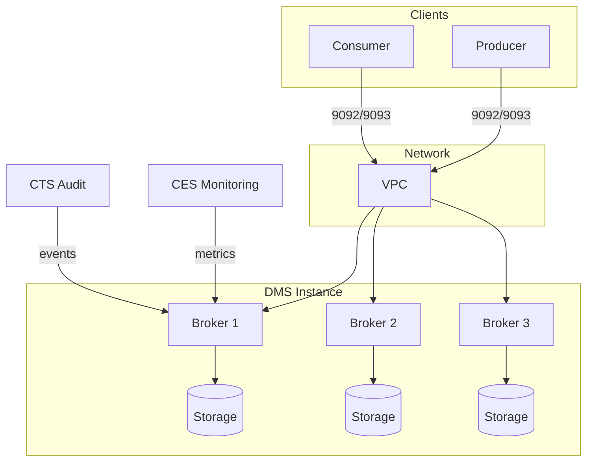

# Core Concepts — Huawei Cloud DMS (Distributed Message Service)

## Architecture Overview

Huawei Cloud DMS provides fully-managed message queue services supporting two engines: **Kafka** (partitioned topic-based) and **RabbitMQ** (AMQP queue-based). DMS manages the infrastructure, partitioning, replication, and failover while users interact through standard Kafka/RabbitMQ client libraries.

### Engine Comparison

| Feature | Kafka | RabbitMQ |
|---------|-------|----------|
| Protocol | Kafka protocol (0.10.x+) | AMQP 0-9-1, MQTT, STOMP |
| Messaging Model | Publish-Subscribe (topics) | Queue-based with exchanges |
| Ordering | Partition-level ordering | Per-queue ordering |
| Throughput | High (100K+ msg/s per broker) | Medium (10K-50K msg/s) |
| Use Case | Event streaming, log aggregation, CDC | Task queues, RPC, routing |
| Client Libraries | Java, Go, Python, Node.js, .NET | Java, Go, Python, Node.js, .NET, Erlang |

### Instance Architecture

### Kafka Instance Components

| Component | Description |
|-----------|-------------|
| **Broker** | Each instance has N brokers (3-30 nodes). Each broker handles read/write for its assigned partitions |
| **Topic** | Logical channel for data streams. Each topic has M partitions for parallel throughput |
| **Partition** | Ordered, immutable sequence of messages. Partitions are distributed across brokers |
| **Consumer Group** | Group of consumers that coordinate to read partitions. One partition → one consumer per group |
| **Replication Factor** | Number of copies for each partition (1-3). RF=3 tolerates 2 broker failures |

### RabbitMQ Instance Components

| Component | Description |
|-----------|-------------|
| **Queue** | Buffer that stores messages. One queue → multiple consumers (competing consumer pattern) |
| **Exchange** | Routing engine that receives messages and routes to queues based on bindings |
| **Binding** | Link between exchange and queue with optional routing key |
| **VHost** | Virtual host for logical isolation within one RabbitMQ instance |
| **Mirrored Queue** | Queue replicated across nodes for high availability |

## Regions & Availability Zones

- DMS instances are **region-scoped**
- Multi-AZ is supported: brokers are distributed across different AZs in same region
- Not all AZs support all instance specifications
- Cross-region message replication requires DMS migration tool or third-party MirrorMaker (Kafka) / Federation plugin (RabbitMQ)

## Instance Specifications

### Kafka Specs

| Spec Code | Brokers (Min) | Max Partitions | Max TPS | Storage/Broker |
|-----------|--------------|---------------|---------|----------------|
| `kafka.2u4g.cluster` | 3 | 300 | 30,000 | 200-600 GB |
| `kafka.4u8g.cluster` | 3 | 600 | 80,000 | 300-1200 GB |
| `kafka.8u16g.cluster` | 3 | 1,200 | 200,000 | 500-2000 GB |
| `kafka.16u32g.cluster` | 3 | 2,400 | 500,000 | 1000-3000 GB |

### RabbitMQ Specs

| Spec Code | Nodes | Max Queues | Max TPS | Storage/Node |
|-----------|-------|-----------|---------|-------------|
| `rabbitmq.2u4g.single` | 1 | 200 | 5,000 | 200-600 GB |
| `rabbitmq.4u8g.cluster` | 3 | 800 | 30,000 | 300-1200 GB |
| `rabbitmq.8u16g.cluster` | 3 | 2,000 | 80,000 | 500-2000 GB |

## Resource Relationships

| Resource | Parent | Relationship |
|----------|--------|-------------|
| DMS Instance | VPC | Instance runs inside VPC |
| Topic (Kafka) | DMS Instance | 1:N - any number of topics per instance |
| Partition | Topic | 1:N - partitions are subdivisions of a topic |
| Consumer Group | Topic | M:N - multiple groups can consume same topic independently |
| Queue (RabbitMQ) | DMS Instance | 1:N - many queues per instance |
| Exchange (RabbitMQ) | DMS Instance | 1:N - many exchanges per instance |
| Backup | DMS Instance | 1:N - periodic backups for DR |

## Limits & Quotas

| Item | Default Quota | Max Request |
|------|--------------|-------------|
| DMS instances per account | 30 | 200 (support ticket) |
| Topics per Kafka instance | 50-300 (by spec) | Spec-dependent |
| Partitions per Kafka instance | 300-2,400 (by spec) | Spec-dependent |
| Queues per RabbitMQ instance | 200-2,000 | Spec-dependent |
| Max message size | 10MB (Kafka) / 10MB (RabbitMQ) | Configurable |
| Max retention period | 72 hours | 168 hours (configurable) |

## Billing

| Model | Description | Savings vs 按需 |
|-------|-------------|-----------------|
| 按需 (Pay-per-use) | Per-hour billing, no commitment | Baseline |
| 包年包月 (Monthly/Yearly) | 1-month to 3-year commitment | Up to 85% |
