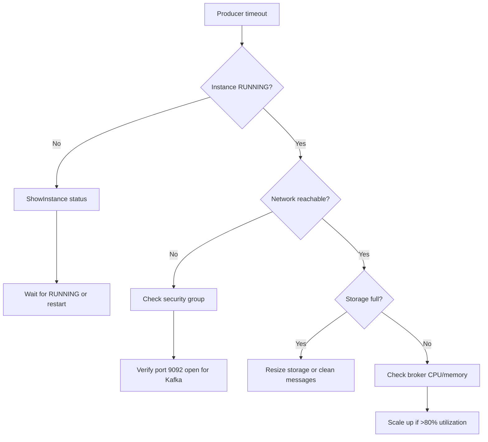

# Troubleshooting — Huawei Cloud DMS

## Error Code Reference

| Code | Message | Cause | Diagnostic | Resolution |
|------|---------|-------|-----------|------------|
| `DMS.00400001` | Resource quota exceeded | Account has reached max DMS instances | `ListInstances` to count active instances | Submit quota increase ticket or delete unused instances |
| `DMS.00400002` | Invalid specification | Spec code doesn't match engine or version | Verify spec against `ShowInstanceTypes` API | Use correct spec code for engine and version |
| `DMS.00400003` | VPC/subnet/SG not found | Network resource doesn't exist in region | `ShowVpc` / `ShowSubnet` / `ShowSecurityGroup` to verify | Create missing network resource |
| `DMS.00400004` | Instance not found | Instance ID is incorrect or instance deleted | `ListInstances` to verify instance exists | Double-check instance ID |
| `DMS.00400005` | Instance not in RUNNING state | Operation requires RUNNING status | `ShowInstance` to check status | Wait for pending operation to complete |
| `DMS.00400006` | Operation not allowed in current status | Create/delete/modify blocked by current status | Check `ShowInstance` status field | Wait for current operation; check `error_code` field |
| `DMS.00400007` | Topic already exists | Topic name conflicts with existing topic | `ListTopics` to view existing topics | Use unique topic name or modify existing topic |
| `DMS.00400008` | Partition limit exceeded | Requested partitions exceed instance spec | Check spec max partitions in `core-concepts.md` | Reduce partition count or upgrade instance spec |
| `DMS.00400009` | Insufficient storage space | Disk usage > 85% threshold | Check `storage_space` vs `storage_used` metrics | Resize storage via `UpdateInstance` or clean old messages |
| `DMS.00400010` | Backup in progress | Another backup operation is running | `ListBackups` to check running backups | Wait for backup to complete; 5 min typical |
| `DMS.00400011` | Invalid engine version | Version not supported in region | Verify supported versions via `ShowInstanceTypes` | Use supported version for target region |
| `DMS.00400012` | Security group rule conflict | Port conflict in security group | `ShowSecurityGroupRules` to verify | Add/remove rules for Kafka (9092/9093) or RabbitMQ (5671/5672) |

## Diagnostic Procedures

### Scenario 1: Producer Timeout



**Commands:**
```bash
# 1. Check instance status
hcloud DMS ShowInstance --instance_id="{{user.instance_id}}"

# 2. Check CES metrics for broker load
hcloud CES ShowMetricData \
  --namespace="SYS.DMS" \
  --metric_name="broker_cpu_usage" \
  --dim="instance_id={{user.instance_id}}" \
  --period="60" --from="-1h" --to="now"

# 3. Check network connectivity from producer host
# telnet to broker endpoint on port 9092
```

### Scenario 2: Consumer Lag

```bash
# 1. Query consumer group lag
hcloud DMS ShowConsumerGroupLag \
  --instance_id="{{user.instance_id}}" \
  --group="{{user.consumer_group}}"

# 2. Check consumer group membership
hcloud DMS ListConsumerGroupMembers \
  --instance_id="{{user.instance_id}}" \
  --group="{{user.consumer_group}}"

# 3. Monitor lag trend over time via CES
hcloud CES ShowMetricData \
  --namespace="SYS.DMS" \
  --metric_name="kafka_messages_consumer_lag" \
  --dim="group={{user.consumer_group}}" \
  --period="60" --from="-6h" --to="now"
```

### Scenario 3: Connection Refused

**Checklist:**
1. Is the instance running? → `ShowInstance`
2. Is the security group allowing the port? → `ShowSecurityGroup`
3. Is the client in the same VPC? → Verify VPC ID matches
4. Is SASL/SSL configured correctly? → Verify credential and protocol
5. Is the instance at max connections? → Check `total_connection_count` metric

### Scenario 4: RabbitMQ Queue Backup (Messages Accumulating)

```bash
# 1. Check queue depth
hcloud DMS ShowQueueStats \
  --instance_id="{{user.instance_id}}" \
  --queue="{{user.queue_name}}"

# 2. Check consumer status
hcloud DMS ListQueueConsumers \
  --instance_id="{{user.instance_id}}" \
  --queue="{{user.queue_name}}"

# 3. Check if consumers are active or blocked
```

## Known Issues

| Issue | Symptom | Workaround | Fix Version |
|-------|---------|-----------|-------------|
| Topic auto-creation disabled | Producer fails with unknown topic | Create topic explicitly before producing | N/A (by design) |
| Max connections per broker | New clients cannot connect | Increase connection quota or add brokers | Scale out |
| Disk I/O bottleneck | High producer latency | Increase storage IOPS or upgrade instance spec | Spec upgrade |
