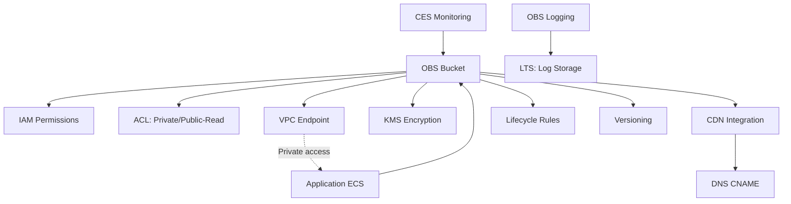

# Core Concepts — Huawei Cloud OBS (Object Storage Service)

## Architecture Overview

OBS (Object Storage Service) is Huawei Cloud's S3-compatible distributed object storage. Data is organized as objects within buckets. Objects are identified by keys (paths) and are accessible from anywhere via the OBS endpoint — buckets are regional, but objects are globally accessible.

### Bucket Naming

- **Global uniqueness**: Bucket names must be unique across ALL Huawei Cloud accounts globally (like S3)
- **Format**: 3-63 characters, lowercase letters, digits, hyphens only; must start and end with letter or digit
- **After creation**: Bucket name cannot be changed; region cannot be changed

### Storage Classes

| Class | Tier | Access | Minimum Storage | Retrieval Cost | Best Use Case |
|-------|------|--------|----------------|----------------|---------------|
| **Standard** | Hot | Immediate | None | None | Frequently accessed data |
| **Warm (IA)** | Infrequent Access | Immediate | 30 days | Per-GB retrieval | Weekly/monthly accessed data |
| **Cold (Archive)** | Archive | 1-5 min restore | 90 days | Per-GB retrieval + restore fee | Compliance archives, backups |
| **Deep Cold** | Deep Archive | 5-15 min restore | 180 days | Highest retrieval cost | Long-term archival, regulatory |

### Object Structure

Each object consists of: **Key** (path) + **Metadata** (custom system/user metadata) + **Data** (content, max 5TB) + **ACL** (access control) + **StorageClass** + **VersionId** (if versioning enabled)

```
obs://bucket-name/path/to/object-key
         │           │
      Bucket      Object Key
```

## Resource Relationship Graph



## Regions & Endpoints

- Buckets are created in a specific **region** (e.g., `cn-north-4` for Beijing)
- Once created, the bucket's region is permanent
- Objects are accessible from any region via the bucket's endpoint URL
- Endpoint format: `obs.{region}.myhuaweicloud.com` (e.g., `obs.cn-north-4.myhuaweicloud.com`)

## Versioning

| State | Behavior |
|-------|----------|
| **Suspended** | Default state — objects are not versioned |
| **Enabled** | Each PUT creates a new versionId; DELETE creates a delete marker |

Key behaviors:
- Once enabled, versioning **cannot be disabled** — only suspended
- Delete operations create **delete markers** (a hidden version), not permanent removal
- Permanent deletion requires DELETE with specific `versionId`
- List with `?versions` parameter shows all versions including delete markers

## Access Control

| Method | Scope | Granularity | Notes |
|--------|-------|-------------|-------|
| **Bucket Policy** | Bucket-level | JSON policy with conditions (IP, referrer, user) | Most flexible |
| **Bucket ACL** | Bucket-level | Predefined: private, public-read, public-read-write | Simple |
| **Object ACL** | Per-object | Inherit bucket or explicit | Overrides bucket ACL |
| **IAM Policy** | User-level | Fine-grained API access control | Cross-bucket management |

## Cross-Origin Resource Sharing (CORS)

Configure per-bucket CORS rules for browser-based access:

```json
{
  "CORSRules": [
    {
      "AllowedOrigin": ["https://example.com"],
      "AllowedMethod": ["GET", "PUT", "POST", "DELETE"],
      "AllowedHeader": ["Authorization", "Content-Type"],
      "ExposeHeader": ["ETag", "x-obs-request-id"],
      "MaxAgeSeconds": 3600
    }
  ]
}
```

## Static Website Hosting

- Configure bucket as static website with index and error documents
- Website endpoint: `http://{bucket_name}.website.obs.{region}.myhuaweicloud.com`
- CDN in front recommended for production websites
- Bucket ACL must allow public read for website traffic

## Lifecycle Rules

Automate object lifecycle management via rules:

```
Object created → [Day 30: Transition to Warm] → [Day 180: Transition to Cold] → [Day 365: Expire/Delete]
```

| Action | Description |
|--------|------------|
| **Transition** | Move object to lower storage class after N days |
| **Expiration** | Permanently delete object after N days |
| **Abort Incomplete Multipart** | Clean up abandoned multipart uploads after N days |

## Quotas & Limits

| Resource | Limit | Notes |
|----------|-------|-------|
| Buckets per account | 100 (default) |可申请增加 |
| Object size (single PUT) | 5 GB | Larger → must use multipart |
| Object size (multipart) | 5 TB | Max object size |
| Part size (multipart) | 5 MB – 5 GB | Parts must be ≥ 5 MB except last |
| Max parts per upload | 10,000 | |
| Key (object name) length | 1024 bytes (UTF-8) | URL-encoded |
| Concurrent connections | No hard limit, but subject to bandwidth | |

## SPOF Analysis

| Scenario | Risk | Mitigation |
|----------|------|------------|
| Single-region bucket failure | **MEDIUM** — region outage makes data unavailable | Cross-Region Replication (CRR) to another region |
| Accidental deletion | **HIGH** — destructive operations are irreversible | Enable versioning; DELETE creates delete marker |
| Data corruption | **LOW** — OBS uses checksums internally; 11 nines durability | Versioning + lifecycle to older versions |
| Public exposure | **HIGH** — incorrect ACL exposes all data | Regular ACL audit, default to private, use bucket policy + IAM |
