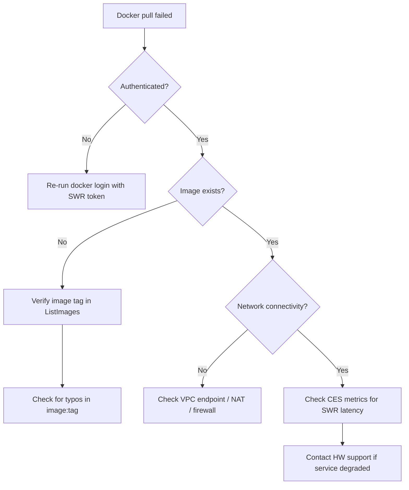
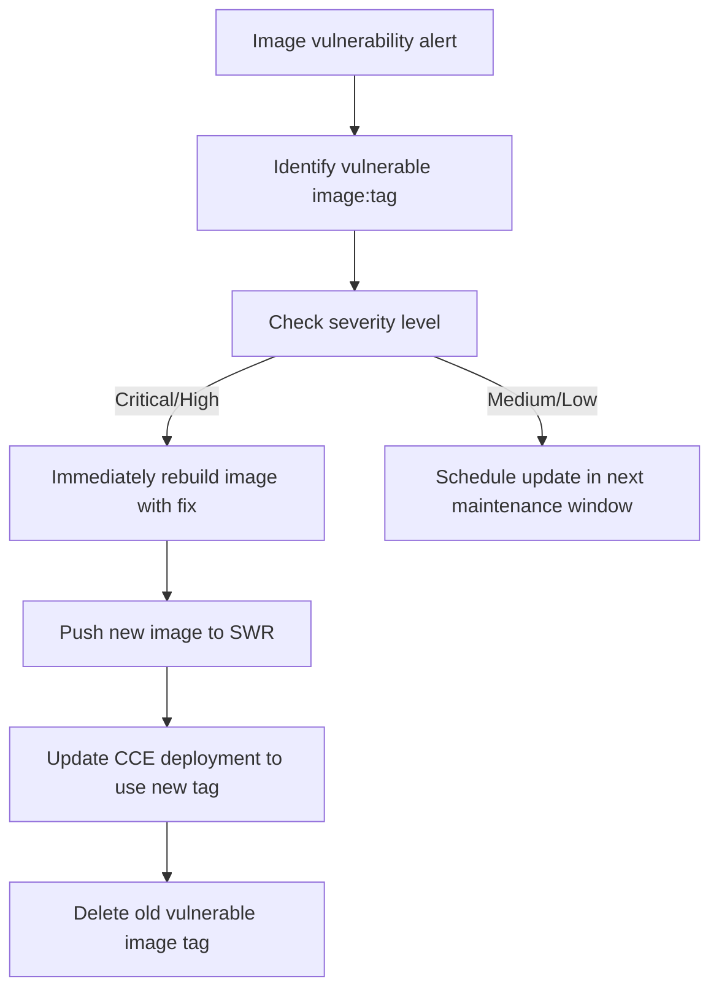

> This skill follows the [Agent Skill Open Specification](https://agentskills.io/specification).

# Huawei Cloud SWR (Software Repository for Container) Operations Skill

## Overview

Huawei Cloud SWR provides fully-managed container image repository service with integrated vulnerability scanning, cross-region synchronization, and lifecycle management. This skill is an **operational runbook** for agents: explicit scope, credential rules, pre-flight checks, **dual-path execution** (official CLI and JIT Go SDK fallback), Docker CLI integration, response validation, and failure recovery.

### CLI applicability (repository policy)

- **`cli_applicability: dual-path`:** Official CLI supports SWR for management operations. `docker` CLI is required for image push/pull operations. In each execution flow below, document **both** the SDK step **and** the CLI step.

## Five Core Standards (Quality Gates)

| # | Standard | How This Skill Fulfills It |
|---|----------|---------------------------|
| 1 | **Clear Boundaries** | SHOULD/SHOULD NOT Use conditions with precise triggers and delegation rules |
| 2 | **Structured I/O** | `{{env.*}}` / `{{user.*}}` / `{{output.*}}` placeholders with typed sources |
| 3 | **Explicit Actionable Steps** | Every operation: Pre-flight → Execute (CLI + SDK) → Validate → Recover |
| 4 | **Complete Failure Strategies** | 12 SWR error codes with HALT vs retry per error type |
| 5 | **Absolute Single Responsibility** | One product (SWR), one primary resource (repository); cross-product delegation documented |

### Three-Pillar Ops Integration (FinOps + SecOps + AIOps)

| Pillar | Skill Integration | Reference |
|--------|-------------------|-----------|
| **FinOps** | Storage cost analysis, image cleanup and reclamation, cross-region sync cost | `references/well-architected-assessment.md` §3 |
| **SecOps** | IAM minimum permissions, image vulnerability scanning, repository-level access control | `references/well-architected-assessment.md` §4 |
| **AIOps** | ≥ 4 anomaly patterns (pull failure, quota exhausted, obsolete image accumulation), cross-skill diagnosis | `references/well-architected-assessment.md` §5 |

### Well-Architected Framework Integration (卓越架构)

| Pillar | Skill Integration |
|--------|-------------------|
| **安全 (Security)** | IAM permissions, credential masking, vulnerability scanning, repository-level access control |
| **稳定 (Stability)** | Cross-region image sync for DR, retention policies, immutable tags |
| **成本 (Cost)** | Storage cost per GB, image cleanup/reclamation, lifecycle policy for old images |
| **效率 (Efficiency)** | Batch operations, CI/CD integration, CLI pipeline with Docker integration |
| **性能 (Performance)** | Geo-replication for faster pulls, image caching at edge |

## Trigger & Scope (Agent-Readable)

### SHOULD Use This Skill When

- User mentions "Huawei Cloud SWR" OR "container image" OR "镜像仓库" OR "容器镜像" OR "SWR"
- Task involves organization or repository CRUD operations (create, delete, list)
- Task involves image management (list tags, delete image, set retention policy)
- Task involves Docker login/push/pull integration with SWR
- Task involves cross-region image synchronization
- Task keywords: **SWR**, **Docker**, **image**, **repository**, **organization**, **container**, **镜像**, **推送**, **拉取**

### SHOULD NOT Use This Skill When
- Task is purely billing / cost analysis / 费用 / 预算 → delegate to: `huaweicloud-billing-ops`

- Task is IAM/permission model only → delegate to: `huaweicloud-iam-ops`
- Task is about container orchestration (CCE/K8s) → delegate to: `huaweicloud-cce-ops`
- Task is about host-level vulnerability scanning → delegate to: `huaweicloud-hss-ops` (when present)
- Task is about monitoring/alarm rules → delegate to: `huaweicloud-ces-ops`

## Variables

| Variable | Source | Description | Example |
|----------|--------|-------------|---------|
| `{{env.HW_ACCESS_KEY_ID}}` | Environment | Huawei Cloud AK | `AKIA...` |
| `{{env.HW_SECRET_ACCESS_KEY}}` | Environment | Huawei Cloud SK | `***` (masked) |
| `{{env.HW_REGION_ID}}` | Environment | Region code | `cn-north-4` |
| `{{env.HW_PROJECT_ID}}` | Environment | Project ID | `a1b2c3d4...` |
| `{{user.organization_name}}` | User | SWR organization name | `my-org` |
| `{{user.repository_name}}` | User | Repository name | `nginx` or `my-org/nginx` |
| `{{user.image_name}}` | User | Full image name with tag | `swr.cn-north-4.myhuaweicloud.com/my-org/nginx:1.25` |
| `{{user.tag_name}}` | User | Image tag | `1.25`, `latest` |
| `{{user.retention_days}}` | User | Image retention days | `30` |
| `{{user.retention_count}}` | User | Max images to retain | `10` |
| `{{user.sync_region}}` | User | Target sync region | `cn-south-1` |
| `{{user.type}}` | User | Repository type | `app_server` or `linux` |
| `{{output.image_digest}}` | Output | Image digest SHA256 | From API response |
| `{{output.organization_id}}` | Output | Organization UUID | From API response |

## Operations

### 1. Organization Management

#### 1.1 Create Organization

**Pre-flight:**
- [ ] Verify SWR namespace availability — organization names are globally unique per region

**Execute (CLI):**
```bash
hcloud SWR CreateOrganization \
  --name="{{user.organization_name}}" \
  --region="{{env.HW_REGION_ID}}"
```

**Execute (SDK - JIT Go):**
```go
package main

import (
    "fmt"
    "github.com/huaweicloud/huaweicloud-sdk-go-v3/core/auth/basic"
    "github.com/huaweicloud/huaweicloud-sdk-go-v3/services/swr/v2"
    "github.com/huaweicloud/huaweicloud-sdk-go-v3/services/swr/v2/model"
)

func main() {
    auth := basic.NewCredentialsBuilder().
        WithAk("{{env.HW_ACCESS_KEY_ID}}").
        WithSk("{{env.HW_SECRET_ACCESS_KEY}}").
        WithProjectId("{{env.HW_PROJECT_ID}}").
        Build()
    client := swr.NewSwrClient(
        swr.SwrClientBuilder().WithRegion("{{env.HW_REGION_ID}}").WithCredential(auth).Build(),
    )
    req := &model.CreateOrganizationReq{
        Namespace: "{{user.organization_name}}",
    }
    resp, err := client.CreateOrganization(req)
    if err != nil {
        panic(err)
    }
    fmt.Println(resp.Id)
}
```

**Validate:**
- [ ] Organization appears in `ListOrganizations`
- [ ] Organization name matches input

#### 1.2 List Organizations

**Execute (CLI):**
```bash
hcloud SWR ListOrganizations \
  --region="{{env.HW_REGION_ID}}"
```

#### 1.3 Delete Organization

> **⚠️ DESTRUCTIVE OPERATION — All repositories and images in organization will be permanently deleted.**

**Pre-flight:**
- [ ] Confirm organization name with user
- [ ] List repositories to verify impact scope

**Execute (CLI):**
```bash
hcloud SWR DeleteOrganization \
  --name="{{user.organization_name}}" \
  --region="{{env.HW_REGION_ID}}"
```

### 2. Repository Management

#### 2.1 Create Repository

**Pre-flight:**
- [ ] Organization must exist
- [ ] Choose repository type (`app_server` or `linux`)

**Execute (CLI):**
```bash
hcloud SWR CreateRepository \
  --organization="{{user.organization_name}}" \
  --name="{{user.repository_name}}" \
  --type="{{user.type}}" \
  --description="Production images" \
  --region="{{env.HW_REGION_ID}}"
```

**Validate:**
- [ ] Repository appears in `ListRepositories`

#### 2.2 List Repositories

**Execute (CLI):**
```bash
hcloud SWR ListRepositories \
  --organization="{{user.organization_name}}" \
  --region="{{env.HW_REGION_ID}}"
```

#### 2.3 Delete Repository

> **⚠️ DESTRUCTIVE OPERATION — All images in repository will be permanently deleted.**

**Pre-flight:**
- [ ] Confirm repository name with user
- [ ] List image count in repository

**Execute (CLI):**
```bash
hcloud SWR DeleteRepository \
  --organization="{{user.organization_name}}" \
  --name="{{user.repository_name}}" \
  --region="{{env.HW_REGION_ID}}"
```

### 3. Image & Tag Management

#### 3.1 List Images

**Execute (CLI):**
```bash
hcloud SWR ListImages \
  --organization="{{user.organization_name}}" \
  --repository="{{user.repository_name}}" \
  --region="{{env.HW_REGION_ID}}"
```

**Validate:**
- [ ] Returns image list with tags, size, digest, push time
- [ ] Note images with pull count and vulnerability status

#### 3.2 Delete Image Tag

> **⚠️ DESTRUCTIVE OPERATION — Image tag will be permanently deleted.**

**Pre-flight:**
- [ ] Confirm image tag with user
- [ ] Check if image is referenced by any running deployments (via CCE)

**Execute (CLI):**
```bash
hcloud SWR DeleteImageTag \
  --organization="{{user.organization_name}}" \
  --repository="{{user.repository_name}}" \
  --tag="{{user.tag_name}}" \
  --region="{{env.HW_REGION_ID}}"
```

#### 3.3 Docker Login (for Push/Pull)

**Execute:**
```bash
# Generate temporary login credentials
hcloud SWR GenerateLoginToken \
  --region="{{env.HW_REGION_ID}}" > /tmp/swr_token.json

# Login to SWR registry
cat /tmp/swr_token.json | docker login \
  -u {{env.HW_ACCESS_KEY_ID}} \
  --password-stdin \
  swr.{{env.HW_REGION_ID}}.myhuaweicloud.com
```

**Validate:**
- [ ] `docker login` returns `Login Succeeded`
- [ ] Verify push/pull works with test image

#### 3.4 Pull Image

```bash
docker pull swr.{{env.HW_REGION_ID}}.myhuaweicloud.com/{{user.organization_name}}/{{user.repository_name}}:{{user.tag_name}}
```

#### 3.5 Push Image

```bash
# Tag local image
docker tag {{user.image_name}} \
  swr.{{env.HW_REGION_ID}}.myhuaweicloud.com/{{user.organization_name}}/{{user.repository_name}}:{{user.tag_name}}

# Push to SWR
docker push swr.{{env.HW_REGION_ID}}.myhuaweicloud.com/{{user.organization_name}}/{{user.repository_name}}:{{user.tag_name}}
```

### 4. Retention Policy

#### 4.1 Create Retention Policy

**Execute (CLI):**
```bash
hcloud SWR CreateRetentionPolicy \
  --organization="{{user.organization_name}}" \
  --repository="{{user.repository_name}}" \
  --algorithm="retain_most_recent" \
  --count="{{user.retention_count}}" \
  --region="{{env.HW_REGION_ID}}"
```

**Validate:**
- [ ] Policy appears in `ListRetentionPolicies`
- [ ] Verify old images are automatically cleaned next cycle

### 5. Cross-Region Synchronization

#### 5.1 Create Image Sync Rule

**Pre-flight:**
- [ ] Verify target region has SWR service
- [ ] Ensure target organization exists (or create one)

**Execute (CLI):**
```bash
hcloud SWR CreateImageSync \
  --organization="{{user.organization_name}}" \
  --repository="{{user.repository_name}}" \
  --target_region="{{user.sync_region}}" \
  --target_org="{{user.organization_name}}" \
  --region="{{env.HW_REGION_ID}}"
```

**Validate:**
- [ ] Sync rule appears in `ListImageSync`
- [ ] Verify image appears in target region's repository

### 6. Monitoring

**Execute (CLI):**
```bash
# Query SWR metrics via CES
hcloud CES ListMetrics \
  --namespace="SYS.SWR" \
  --region="{{env.HW_REGION_ID}}"

# Query repository storage usage
hcloud CES ShowMetricData \
  --namespace="SYS.SWR" \
  --metric_name="repo_storage_usage" \
  --dim="repo_name={{user.repository_name}}" \
  --period="3600" \
  --from="{{user.start_time}}" \
  --to="{{user.end_time}}" \
  --region="{{env.HW_REGION_ID}}"
```

## Failure Recovery

### Error Code Taxonomy

| Code | Category | Action |
|------|----------|--------|
| `SWR.0001` | Conflict | Choose different organization name |
| `SWR.0002` | NotFound | Verify organization name is correct |
| `SWR.0003` | Conflict | Use different repository name |
| `SWR.0004` | NotFound | Verify repository name is correct |
| `SWR.0005` | NotFound | Verify image tag exists in repository |
| `SWR.0006` | Quota | Delete unused organizations or request limit increase |
| `SWR.0007` | Quota | Delete unused repositories or request limit increase |
| `SWR.0008` | Quota | Delete old images or increase storage quota |
| `SWR.0009` | Config | Verify image name follows Docker naming conventions |
| `SWR.0010` | Conflict | Modify existing sync rule or delete and recreate |
| `SWR.0011` | Config | Verify SWR is available in target region |
| `SWR.0012` | Config | Remove existing policy before creating new one |

### Diagnostic Flow (Image Pull Failure)



### Diagnostic Flow (Vulnerability Found)



## Well-Architected Assessment

This skill follows the Huawei Cloud Well-Architected Framework across five pillars plus FinOps, SecOps, and AIOps. See:

- **Full Assessment:** [`references/well-architected-assessment.md`](references/well-architected-assessment.md)
- **Core Concepts:** [`references/core-concepts.md`](references/core-concepts.md)
- **API & SDK Usage:** [`references/api-sdk-usage.md`](references/api-sdk-usage.md)
- **CLI Usage:** [`references/cli-usage.md`](references/cli-usage.md)
- **Troubleshooting:** [`references/troubleshooting.md`](references/troubleshooting.md)
- **Monitoring:** [`references/monitoring.md`](references/monitoring.md)
- **Integration:** [`references/integration.md`](references/integration.md)
- **Idempotency Checklist:** [`references/idempotency-checklist.md`](references/idempotency-checklist.md)

## Quality Gate (GCL)

This skill is **GCL-required** (per `AGENTS.md` §8). Every SWR (container image registry)
mutating operation — organization create / delete, repository create / delete, image / tag
delete, retention policy create / update, cross-tenant share — runs through the
**Generator-Critic-Loop** before its result is returned. Read-only are GCL-**exempt**.

| Field | Value |
|-------|-------|
| Rubric version | v1 (Phase 2, 2026-06-04) |
| `max_iter` | **2** |
| Rubric instance | [`references/rubric.md`](references/rubric.md) |
| Prompt templates | [`references/prompt-templates.md`](references/prompt-templates.md) |
| Trace path | `./audit-results/gcl-trace-YYYYMMDD-HHMMSS.json` |
| Independence | Generator and Critic in **isolated** sub-agent / session contexts |

### Five-Dimension Rubric (summary)

| # | Dimension | Threshold | Notes |
|---|-----------|-----------|-------|
| 1 | Correctness | ≥ 0.5 (1.0 for `delete-org` / `delete-repo` / `delete-image-tag`) | `ListOrganizations` / `ListRepositories` / `ListImageTags` post-state |
| 2 | Safety | **= 1** (any S-rule hit → ABORT) | S1–S15 in rubric §2 |
| 3 | Idempotency | ≥ 0.5 | Pre-check before create; see also `references/idempotency-checklist.md` |
| 4 | Traceability | ≥ 0.5 | `password` / docker registry password MUST be `<masked>` |
| 5 | Spec Compliance | ≥ 0.5 | Org / repo / tag name regex; retention range |

### Per-Operation Safety Anchors (binding)

- **S1 / S2 / S3** — `delete-organization` confirmation / org has repos / last default org
- **S4 / S5** — `delete-repository` confirmation + namespace / **CCE/CCI image-in-use cross-check**
- **S6 / S7** — `delete-image` two-step / `delete-image-tag` per-tag CCE/CCI check
- **S8 / S9** — retention `retention_days < 1` / `tag_count < 5` on prod repo
- **S10 / S13** — reserved `library` org / `library/*` repo name
- **S14** — `delete-image-tag` for hot image (pull_count_last_30d > 0)
- **S15** — `share-repository` without explicit `account_id` confirmation

### Termination Contract (per `AGENTS.md` §5)

| Condition | Status | Returned |
|-----------|--------|----------|
| All dimensions pass | **PASS** | Generator result + scores + trace path |
| `iter == max_iter` (2) and any dim < threshold | **MAX_ITER** | best-so-far + unresolved rubric items |
| `Safety == 0` | **SAFETY_FAIL** | violated S-rule id; **never** return partial |

### Trace Persistence (mandatory)

Every GCL run writes `./audit-results/gcl-trace-YYYYMMDD-HHMMSS.json` (schema in
`references/prompt-templates.md` §3). Trace is **append-only**; sanitize secrets before write
(see `prompt-templates.md` §4). The path `./audit-results/` is in root `.gitignore`.

### See also

- [`references/rubric.md`](references/rubric.md) — full rubric, S1–S15 rules, per-op thresholds
- [`references/prompt-templates.md`](references/prompt-templates.md) — Generator / Critic / Orchestrator skeletons
- Repository root [`AGENTS.md`](../AGENTS.md) §3, §5, §7, §8 — GCL specification

## Appendices

### A. References

- [Huawei Cloud SWR API Documentation](https://support.huaweicloud.com/api-swr/)
- [Huawei Cloud Go SDK](https://github.com/huaweicloud/huaweicloud-sdk-go-v3)
- [Huawei Cloud CLI](https://support.huaweicloud.com/hcli/index.html)
- [Docker CLI Documentation](https://docs.docker.com/engine/reference/commandline/)
- [GCL Rubric](references/rubric.md) — Adversarial quality gate (v1, 5-dim, S1–S15 SWR-specific Safety rules; CCE/CCI image-in-use cross-check)
- [GCL Prompt Templates](references/prompt-templates.md) — Generator / Critic / Orchestrator skeletons

### B. Changelog

| Version | Date | Changes |
|---------|------|---------|
| 1.0.0 | 2026-05-21 | Initial SWR ops skill with organization, repository, image, retention policy, sync |

> 任务完成后按根 AGENTS.md 的「复利资产沉淀机制 (CADL)」复盘并沉淀可复用资产。
