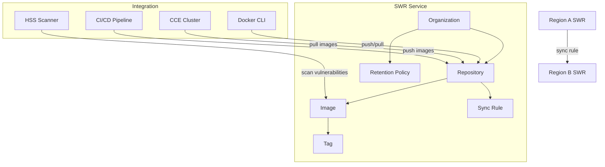

# Core Concepts — Huawei Cloud SWR (Software Repository for Container)

## Architecture Overview

Huawei Cloud SWR provides fully-managed container image registry service. It stores, manages, and distributes Docker/OCI container images with integrated vulnerability scanning, cross-region synchronization, and lifecycle management.

### Core Components

### Organization

- **Top-level namespace** for grouping repositories
- Globally unique within a Huawei Cloud account
- Used as part of image URL: `swr.{region}.myhuaweicloud.com/{organization}/{repository}:{tag}`
- Access permissions are managed at organization level

### Repository

- A named container for images within an organization
- Two types: `app_server` (application images) and `linux` (base OS images)
- Repository name becomes part of the image URL path

### Image & Tag

| Concept | Description |
|---------|-------------|
| **Image** | Immutable snapshot of container filesystem + metadata |
| **Tag** | Mutable reference to an image (e.g., `1.25`, `latest`) |
| **Digest** | Immutable SHA256 identifier for an image |
| **Manifest** | JSON descriptor of image layers and configuration |

## Regions & Availability

- SWR is **region-scoped** — images are stored in the region where the repository exists
- Cross-region synchronization copies images between regions automatically
- Public images are accessible from any region
- Each region has its own SWR endpoint: `swr.{region}.myhuaweicloud.com`

## Limits & Quotas

| Item | Default Quota | Max Request |
|------|--------------|-------------|
| Organizations per account | 5 | 50 (support ticket) |
| Repositories per organization | 50 | 200 (support ticket) |
| Image tags per repository | 500 | Unlimited (support ticket) |
| Image size | 10GB | 20GB (support ticket) |
| Total storage per account | 500GB | 5TB (support ticket) |
| Concurrent pull per repo | 300 | 1000 (support ticket) |

## Billing

| Component | Model | Cost |
|-----------|-------|------|
| Storage | Per GB per hour | ~0.0003 USD/GB/h (按需) |
| Pull traffic (intra-region) | Free | Free |
| Pull traffic (cross-region) | Egress data transfer | Per GB |
| Vulnerability scanning | Free | Included |
| Cross-region sync | Storage in target region | Per GB stored |
